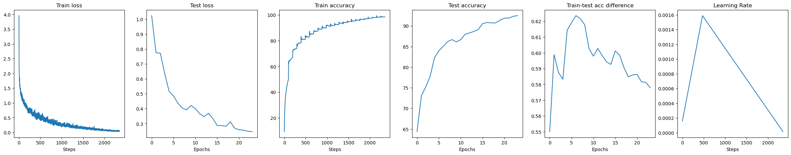

# Session 10: Residual Connections in CNNs and One Cycle Policy

## Assignment Overview

The goal is to create and train a custom Resnet architecture to obtain a 90% accuracy on the CIFAR10 test set under the following constraints:
- Use only the architecture provided in the assignment
- Train using One Cycle Learning Policy
- Use Adam optimizer along with Cross Entropy Loss
- Use range test to identify the max (and hence min) learning rates
- 24 epochs with max lr realised at epoch #5
- 5 albumentation transforms - Normalize, Pad, RandomCrop, FlipLR, Cutout

Additionally, the assignment repo should contain only a notebook and a readme file with instructions. All relevant code must be imported from a separate modular master Github repo

## Solution Repo Overview

`s10_main.ipynb` is the main experiment notebook that demonstrates the solution. All relevant code is maintained in an [ERAV2 Master repo](https://github.com/karthajee/ERAV2master) that is cloned in the notebook. Structure of the repo cloned:

| File/Folder | Description |
| --- | --- |
| `models` | Directory containing network modules for each assignment (for e.g. `assignment10.py` for this assignment) |
| `training.py` | Contains Trainer class with corresponding train and test methods |
| `transform.py` | Contains Transform class for the required albumentation transforms for the assignment |
| `utils.py` | Convenience functions for device management etc. |
| `weights` | Directory that contains saved model checkpoints |

Naming convention followed for the weights: `ass{N}_{YYYY}{MM}{DD}_{HH}{MM}{SS}` where:
- `N` is the number of the session for the assignment
- `YYYY` is year of model saving 
- `MM` is month of model saving 
- `DD` is day of model saving 
- `HH` is hour of model saving 
- `MM` is minutes of model saving 
- `SS` is seconds of model saving 

## Model Summary

````
==========================================================================================
Layer (type:depth-idx)                   Output Shape              Param #
==========================================================================================
Net                                      [1, 10]                   --
├─Sequential: 1-1                        [1, 64, 32, 32]           --
│    └─Conv2d: 2-1                       [1, 64, 32, 32]           1,792
│    └─BatchNorm2d: 2-2                  [1, 64, 32, 32]           128
│    └─ReLU: 2-3                         [1, 64, 32, 32]           --
├─ResLayer: 1-2                          [1, 128, 16, 16]          --
│    └─Sequential: 2-4                   [1, 128, 16, 16]          --
│    │    └─Conv2d: 3-1                  [1, 128, 32, 32]          73,856
│    │    └─MaxPool2d: 3-2               [1, 128, 16, 16]          --
│    │    └─BatchNorm2d: 3-3             [1, 128, 16, 16]          256
│    │    └─ReLU: 3-4                    [1, 128, 16, 16]          --
│    └─ResBlock: 2-5                     [1, 128, 16, 16]          --
│    │    └─Sequential: 3-5              [1, 128, 16, 16]          295,680
├─Sequential: 1-3                        [1, 256, 8, 8]            --
│    └─Conv2d: 2-6                       [1, 256, 16, 16]          295,168
│    └─MaxPool2d: 2-7                    [1, 256, 8, 8]            --
│    └─BatchNorm2d: 2-8                  [1, 256, 8, 8]            512
│    └─ReLU: 2-9                         [1, 256, 8, 8]            --
├─ResLayer: 1-4                          [1, 512, 4, 4]            --
│    └─Sequential: 2-10                  [1, 512, 4, 4]            --
│    │    └─Conv2d: 3-6                  [1, 512, 8, 8]            1,180,160
│    │    └─MaxPool2d: 3-7               [1, 512, 4, 4]            --
│    │    └─BatchNorm2d: 3-8             [1, 512, 4, 4]            1,024
│    │    └─ReLU: 3-9                    [1, 512, 4, 4]            --
│    └─ResBlock: 2-11                    [1, 512, 4, 4]            --
│    │    └─Sequential: 3-10             [1, 512, 4, 4]            4,721,664
├─Sequential: 1-5                        [1, 10]                   --
│    └─MaxPool2d: 2-12                   [1, 512, 1, 1]            --
│    └─Flatten: 2-13                     [1, 512]                  --
│    └─Linear: 2-14                      [1, 10]                   5,130
==========================================================================================
Total params: 6,575,370
Trainable params: 6,575,370
Non-trainable params: 0
Total mult-adds (M): 379.64
==========================================================================================
Input size (MB): 0.01
Forward/backward pass size (MB): 4.65
Params size (MB): 26.30
Estimated Total Size (MB): 30.97
==========================================================================================
````

## Design Choices

- Chose a low minimum learning rate of `1e-5` as starting point for the range test to cover the lower spectrum of learning rates
- Used ReLU after addition of X and R in the Resnet block. This is the only choice different from the provided architecture. This had the effect of boosting both training and test performance to the required levels of the assignment without any compromises. Interestingly, the solution file also invoked the same design choice

## Train-Test Loss & Accuracy Curves

