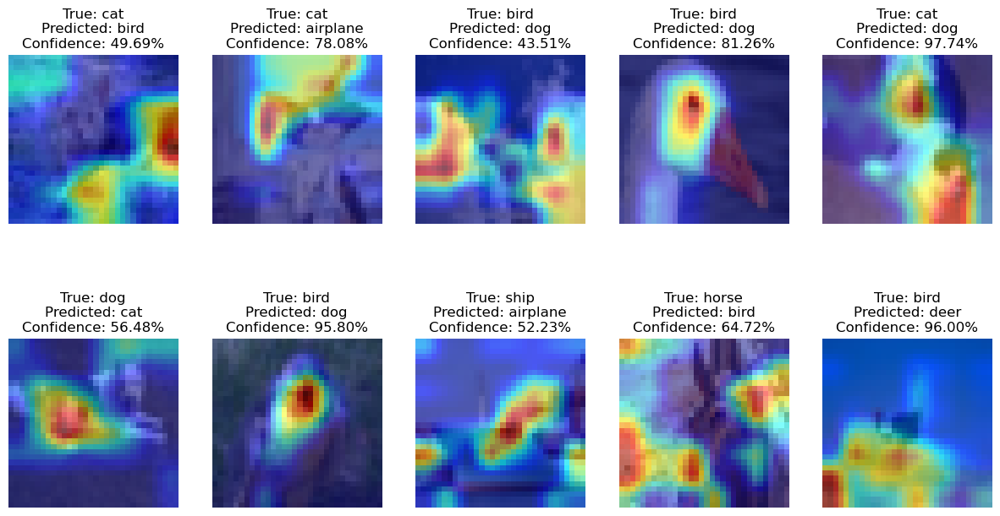

# Session 11 - Class Activation Maps, LRs and Optimizers

## Assignment Overview

The goal is to create and train a Resnet50 model (from [here](https://github.com/kuangliu/pytorch-cifar)) for 20 epochs and display the following image artefacts:

- loss curves for test and train datasets
- Gallery of 10 misclassified images
- gradcam output on the 10 misclassified images (using layers at least 5px)

Additionally, the assignment repo should contain only a notebook and a readme file with instructions. All relevant code must be imported from a separate modular master Github repo

## Solution Repo Overview

`s11_main.ipynb` is the main experiment notebook that demonstrates the solution. All relevant code is maintained in an [ERAV2 Master repo](https://github.com/karthajee/ERAV2master) that is cloned in the notebook. Structure of the repo cloned:

| File/Folder | Description |
| --- | --- |
| `models` | Directory containing network modules for each assignment (for e.g. `assignment10.py` for this assignment) |
| `training.py` | Contains Trainer class with corresponding train and test methods |
| `transform.py` | Contains Transform class for the required albumentation transforms for the assignment |
| `utils.py` | Convenience functions for device management, gradcam, misclassified images etc. |
| `weights` | Directory that contains saved model checkpoints |

Naming convention followed for the weights: `ass{N}_{YYYY}{MM}{DD}_{HH}{MM}{SS}` where:
- `N` is the number of the session for the assignment
- `YYYY` is year of model saving 
- `MM` is month of model saving 
- `DD` is day of model saving 
- `HH` is hour of model saving 
- `MM` is minutes of model saving 
- `SS` is seconds of model saving 

## Model Summary

````
==========================================================================================
Layer (type:depth-idx)                   Output Shape              Param #
==========================================================================================
Net                                      [1, 10]                   --
├─Conv2d: 1-1                            [1, 64, 32, 32]           1,728
├─BatchNorm2d: 1-2                       [1, 64, 32, 32]           128
├─Sequential: 1-3                        [1, 64, 32, 32]           --
│    └─BasicBlock: 2-1                   [1, 64, 32, 32]           --
│    │    └─Conv2d: 3-1                  [1, 64, 32, 32]           36,864
│    │    └─BatchNorm2d: 3-2             [1, 64, 32, 32]           128
│    │    └─Conv2d: 3-3                  [1, 64, 32, 32]           36,864
│    │    └─BatchNorm2d: 3-4             [1, 64, 32, 32]           128
│    │    └─Sequential: 3-5              [1, 64, 32, 32]           --
│    └─BasicBlock: 2-2                   [1, 64, 32, 32]           --
│    │    └─Conv2d: 3-6                  [1, 64, 32, 32]           36,864
│    │    └─BatchNorm2d: 3-7             [1, 64, 32, 32]           128
│    │    └─Conv2d: 3-8                  [1, 64, 32, 32]           36,864
│    │    └─BatchNorm2d: 3-9             [1, 64, 32, 32]           128
│    │    └─Sequential: 3-10             [1, 64, 32, 32]           --
├─Sequential: 1-4                        [1, 128, 16, 16]          --
│    └─BasicBlock: 2-3                   [1, 128, 16, 16]          --
│    │    └─Conv2d: 3-11                 [1, 128, 16, 16]          73,728
│    │    └─BatchNorm2d: 3-12            [1, 128, 16, 16]          256
│    │    └─Conv2d: 3-13                 [1, 128, 16, 16]          147,456
│    │    └─BatchNorm2d: 3-14            [1, 128, 16, 16]          256
│    │    └─Sequential: 3-15             [1, 128, 16, 16]          8,448
│    └─BasicBlock: 2-4                   [1, 128, 16, 16]          --
│    │    └─Conv2d: 3-16                 [1, 128, 16, 16]          147,456
│    │    └─BatchNorm2d: 3-17            [1, 128, 16, 16]          256
│    │    └─Conv2d: 3-18                 [1, 128, 16, 16]          147,456
│    │    └─BatchNorm2d: 3-19            [1, 128, 16, 16]          256
│    │    └─Sequential: 3-20             [1, 128, 16, 16]          --
├─Sequential: 1-5                        [1, 256, 8, 8]            --
│    └─BasicBlock: 2-5                   [1, 256, 8, 8]            --
│    │    └─Conv2d: 3-21                 [1, 256, 8, 8]            294,912
│    │    └─BatchNorm2d: 3-22            [1, 256, 8, 8]            512
│    │    └─Conv2d: 3-23                 [1, 256, 8, 8]            589,824
│    │    └─BatchNorm2d: 3-24            [1, 256, 8, 8]            512
│    │    └─Sequential: 3-25             [1, 256, 8, 8]            33,280
│    └─BasicBlock: 2-6                   [1, 256, 8, 8]            --
│    │    └─Conv2d: 3-26                 [1, 256, 8, 8]            589,824
│    │    └─BatchNorm2d: 3-27            [1, 256, 8, 8]            512
│    │    └─Conv2d: 3-28                 [1, 256, 8, 8]            589,824
│    │    └─BatchNorm2d: 3-29            [1, 256, 8, 8]            512
│    │    └─Sequential: 3-30             [1, 256, 8, 8]            --
├─Sequential: 1-6                        [1, 512, 4, 4]            --
│    └─BasicBlock: 2-7                   [1, 512, 4, 4]            --
│    │    └─Conv2d: 3-31                 [1, 512, 4, 4]            1,179,648
│    │    └─BatchNorm2d: 3-32            [1, 512, 4, 4]            1,024
│    │    └─Conv2d: 3-33                 [1, 512, 4, 4]            2,359,296
│    │    └─BatchNorm2d: 3-34            [1, 512, 4, 4]            1,024
│    │    └─Sequential: 3-35             [1, 512, 4, 4]            132,096
│    └─BasicBlock: 2-8                   [1, 512, 4, 4]            --
│    │    └─Conv2d: 3-36                 [1, 512, 4, 4]            2,359,296
│    │    └─BatchNorm2d: 3-37            [1, 512, 4, 4]            1,024
│    │    └─Conv2d: 3-38                 [1, 512, 4, 4]            2,359,296
│    │    └─BatchNorm2d: 3-39            [1, 512, 4, 4]            1,024
│    │    └─Sequential: 3-40             [1, 512, 4, 4]            --
├─Linear: 1-7                            [1, 10]                   5,130
==========================================================================================
Total params: 11,173,962
Trainable params: 11,173,962
Non-trainable params: 0
Total mult-adds (M): 555.43
==========================================================================================
Input size (MB): 0.01
Forward/backward pass size (MB): 9.83
Params size (MB): 44.70
Estimated Total Size (MB): 54.54
==========================================================================================
````

## Observations and Outcomes

- Attained test accuracy of 92%
- Chose a low minimum learning rate of `1e-5` as starting point for the range test to cover the lower spectrum of learning rates
- Subsequent layer gradcam outputs provide more granular explainability on the portions of the input that contributes the most to incorrect predictions for the misclassified images

## Train-Test Loss & Accuracy Curves


## Misclassified Images


## GradCam

### Layer 3 (last block) 



### Layer 2 (last block)

